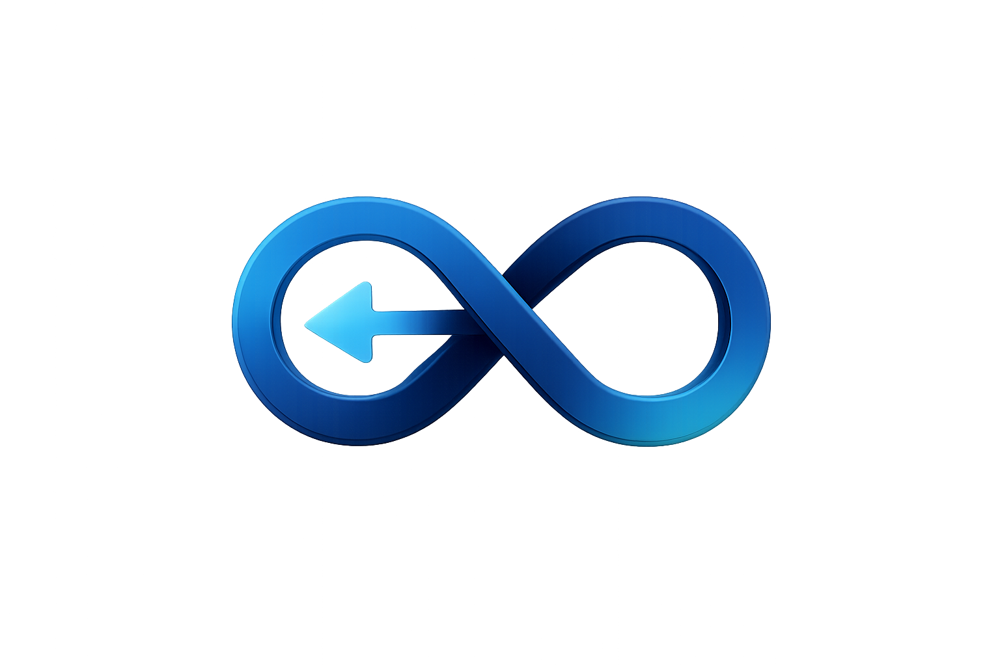

<div align="center">

```
██████╗ ███████╗██╗    ██╗██╗███╗   ██╗██████╗     ██╗  ██╗
██╔══██╗██╔════╝██║    ██║██║████╗  ██║██╔══██╗    ╚██╗██╔╝
██████╔╝█████╗  ██║ █╗ ██║██║██╔██╗ ██║██║  ██║     ╚███╔╝
██╔══██╗██╔══╝  ██║███╗██║██║██║╚██╗██║██║  ██║     ██╔██╗
██║  ██║███████╗╚███╔███╔╝██║██║ ╚████║██████╔╝    ██╔╝ ██╗
╚═╝  ╚═╝╚══════╝ ╚══╝╚══╝ ╚═╝╚═╝  ╚═══╝╚═════╝     ╚═╝  ╚═╝
```



### Reversible Transfer Layer for ERC-20 Tokens


[](https://rewindx.io)
[](https://ethereum.org)
[](LICENSE)

**A simple mistake should not mean permanent loss.**

[Website](https://rewindx.io) · [Twitter/X](https://x.com/calvinrewindx) · [LinkedIn](https://www.linkedin.com/in/calvin-x-568767399) · [Contact](#-contact)

---

</div>

## ⚡ The Problem

> **$2.8B+ lost annually** to irreversible transfer errors, wallet typos, and human mistakes on EVM chains.
>
> Once sent, it's gone. Until now.

<br>

## 🔮 What is Rewind X?

Rewind X introduces a **deterministic, non-custodial undo window** for ERC-20 transfers.

```
┌─────────────────────────────────────────────────────────────────┐
│                                                                 │
│   SEND ──────► [ 2min-48h SAFETY WINDOW ] ──────► FINALIZE     │
│                        │                                        │
│                        ▼                                        │
│                    REWIND?                                      │
│                   ↺ Cancel                                      │
│                                                                 │
└─────────────────────────────────────────────────────────────────┘
```

<br>

<div align="center">

| Feature | Description |
|:-------:|:------------|
| 🕐 | **2min–48h Undo Window** — Deterministic, on-chain safety period |
| 🔐 | **Non-Custodial** — No admin keys can move funds, no trust required |
| 🎖️ | **Fragment NFT** — Tamper-evident proof index for rewinds |
| ⚙️ | **Non-Upgradeable Core** — Safety modules upgradeable only |
| 🔌 | **Wallet-Ready** — Built for integrations & infrastructure |

</div>

<br>

## 🛡️ Trust Model

```
╔════════════════════════════════════════════════════════════════╗
║                                                                ║
║   ✓  No custody of user funds — ever                          ║
║   ✓  No admin keys can move or redirect balances              ║
║   ✓  All actions are rule-based smart contract executions     ║
║   ✓  Emergency pause only — balances always remain in place   ║
║   ✓  Fully auditable, fully deterministic                     ║
║                                                                ║
╚════════════════════════════════════════════════════════════════╝
```

<br>

## 📂 Repository Contents

This repository contains the **public marketing assets** for the Rewind X landing page.

```
rewindx-landing/
├── src/
│   └── app/
│       ├── components/     # React components
│       ├── contact/        # Contact page
│       └── ...
├── public/
│   ├── logov2.png          # Primary logo
│   ├── tokenlogo.png       # RWXT token icon
│   ├── tokens/             # Token icons (USDC, USDT, etc.)
│   └── ...
└── next.config.ts          # Next.js configuration
```

> ⚠️ **Note:** Smart contracts are **not** included in this repository.
> They remain private until audit completion and mainnet readiness.

<br>

## 📬 Contact

<div align="center">

| Channel | Address |
|:-------:|:--------|
| 💼 **Investors** | [investors.rewindx@proton.me](mailto:investors.rewindx@proton.me) |
| 🔧 **Technical** | [contact.rewindx@proton.me](mailto:contact.rewindx@proton.me) |
| 𝕏 **Twitter** | [@calvinrewindx](https://x.com/calvinrewindx) |
| 🔗 **LinkedIn** | [Calvin](https://www.linkedin.com/in/calvin-x-568767399) |

</div>

<br>

---

<div align="center">

```
                              ↺
            ┌─────────────────────────────────┐
            │   REWIND X PROTOCOL — 2026      │
            │        The Undo Layer           │
            └─────────────────────────────────┘
```

<sub>Built for the future of safe transfers.</sub>

</div>
