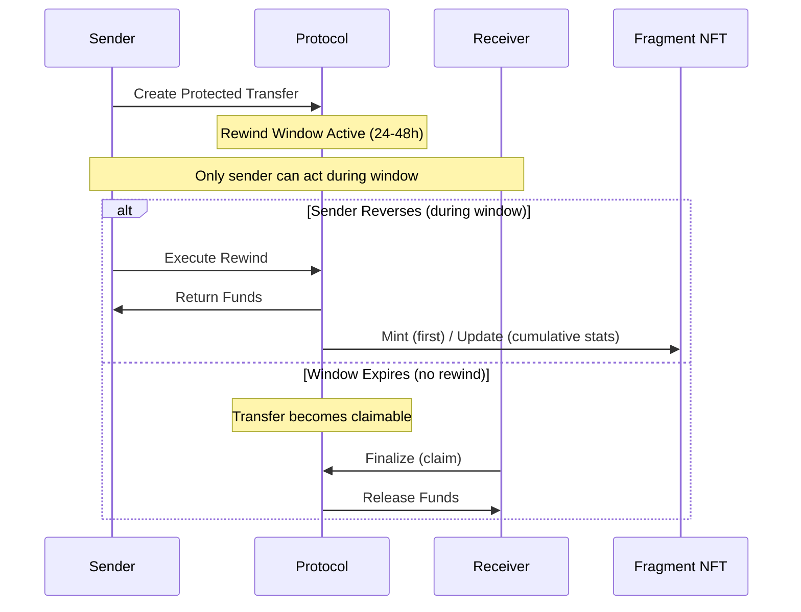

# Rewind X: Lightpaper

**The Reversibility Primitive for Blockchain Transfers**

Version 1.2 | Classification: PUBLIC | December 2025

---

## Abstract

Rewind X introduces time-bounded reversibility for on-chain token transfers, a foundational primitive missing from blockchain infrastructure since inception.

Billions of dollars in cryptocurrency have been lost permanently due to human error, phishing attacks, and address manipulation. Unlike traditional finance, blockchain offers no recourse. Once a transaction confirms, funds are gone forever.

Rewind X solves this through Protected Transfers: a non-custodial, deterministic mechanism that gives senders a configurable window (24 hours standard, up to 48 hours with NFT tiers) to reverse transactions before final settlement. Windows can optionally be configured in hours or minutes (minimum 5 minutes), while the default user experience remains 24 hours. Protected transfers settle as net amounts: the Protection Activation Fee is deducted at creation; the recipient receives the net held amount if no rewind occurs. The protocol requires no manual intervention, holds no private keys, and emits tamper-evident on-chain proof signals for reversals, indexed via the Fragment NFT system.

Rewind X is infrastructure: a protocol-level safety layer that can be used directly by individuals and scaled through integrations with wallets, treasuries, and DeFi applications. As wallets integrate Rewind X, users will see it as a simple "Protected Transfer" option—without custodial intermediaries.

---

## 1. Problem: Finality Without Safety

Blockchain's greatest technical achievement, irreversible finality, is also its most significant barrier to mainstream adoption.

### The Cost of Irreversibility

The scale is staggering—and the causes are predictable and recurring: typographical errors in wallet addresses, copy-paste mistakes, decimal point errors, address poisoning attacks where malicious actors create lookalike addresses, and phishing schemes that redirect funds to attacker-controlled wallets.

Traditional financial systems have evolved comprehensive safeguards: chargebacks, fraud protection, dispute resolution, and regulatory oversight. When a bank customer sends money to the wrong account, there are established processes for recovery. When a credit card is compromised, transactions can be reversed.

Cryptocurrency offers none of these protections. The very properties that make blockchain valuable, decentralization, censorship resistance, trustless operation, also mean there is no central authority to appeal to, no customer service to call, no way to undo a mistake.

### The Adoption Barrier

This creates a fundamental problem for cryptocurrency adoption. Sophisticated users implement elaborate verification procedures before every transaction. Enterprise treasury managers require multiple approval layers. Yet mistakes still happen: a single misplaced character in an address can result in total loss.

For mainstream users, this risk profile is simply unacceptable. The mental overhead of knowing that any transaction could be an irreversible catastrophe prevents the casual usage that characterizes successful financial technologies.

The market needs a solution that preserves blockchain's core properties while adding a safety layer for human fallibility.

---

## 2. Core Principles

Rewind X is built on five non-negotiable principles that distinguish it from centralized alternatives:

### Non-Custodial Architecture

Funds are held in smart contracts under deterministic rules; no party controls them via private keys. During a Protected Transfer, tokens remain in a time-bounded state controlled entirely by smart contract logic. No entity, not the protocol team, not validators, not any third party, can access, redirect, or freeze these funds outside the deterministic rules encoded on-chain.

### Deterministic Execution

Every protocol operation follows predetermined logic with no manual intervention. Whether a transfer finalizes or reverses depends solely on on-chain conditions: time elapsed, sender action, receiver action. There are no human reviewers, no fraud assessment teams, no subjective decisions. Settlement outcomes are deterministic; emergency pause is only for protocol safety and cannot redirect funds.

### Time-Bounded Windows

Reversibility is strictly limited. The standard window is 24 hours; NFT tier holders can extend up to 48 hours. For faster workflows, windows can also be configured in minutes, with a minimum of 5 minutes.

The sender's selected window defines the guaranteed period during which a rewind can be executed. For safety, settlement may finalize shortly after the selected window due to deterministic hold and finality buffers that prevent race conditions and flash-style abuse. Once this deterministic boundary is reached, the transfer becomes claimable; the recipient must finalize to receive funds. After expiry, the transfer is irreversible; claim only releases funds. This bounded approach preserves blockchain's finality guarantee while providing a safety buffer.

### Trust-Minimized Controls

Administrative controls are strictly bounded and cannot move user funds, redirect balances, or override individual transfer outcomes. Emergency controls exist only for protocol-wide pause functionality to halt new operations during incidents; they preserve all balances in place and do not enable selective intervention on specific users or transfers.

### Transparent Proofs

Every reversal emits a tamper-evident on-chain proof trail, indexed by the Fragment NFT system. This creates a verifiable audit trail suitable for compliance requirements, dispute documentation, and forensic analysis.

---

## 3. System Overview

Rewind X operates as a protocol-level safety layer that wraps standard token transfers before final settlement, adding deterministic reversibility without changing L1 consensus or chain rules.

### Protected Transfers

When a user initiates a Protected Transfer, tokens enter a time-bounded state. The transfer is recorded on-chain with a unique identifier, the sender's address, the recipient's address, the token and amount, and the window duration.

During the rewind window, only the sender can act. Two outcomes are possible: the sender reverses the transfer, or the window expires and the transfer becomes claimable by the recipient.

### Multi-Token Support

The protocol operates with any standard ERC-20 token. Users can protect transfers of stablecoins, utility tokens, governance tokens, or any compliant asset.

### Integrity Protections

The protocol includes multiple layers of protection against manipulation and abuse. These systems operate transparently and deterministically, ensuring fair access while preventing exploitation patterns that could harm legitimate users or protocol stability.

---

## 4. Lifecycle of a Protected Transfer

Every Protected Transfer follows a four-stage lifecycle with deterministic transitions.

### Stage 1: Transfer Creation

The sender initiates a Protected Transfer by specifying the recipient, token, amount, and desired window duration (hours or minutes). The protocol validates inputs, calculates applicable fees based on the sender's NFT tier, and records the transfer in a non-upgradeable on-chain registry.

At creation, the protocol deducts the Protection Activation Fee from the transfer amount. The net amount is held under deterministic contract rules until claim or rewind.

### Stage 2: Rewind Window

The rewind window begins immediately upon transfer creation. During this period, the sender retains exclusive reversal rights. No other party—not the receiver, not the protocol, not any external entity—can act. The receiver has no claim or settlement rights until the window expires.

Critically, no party can extend or shorten the window after creation. The duration (hours or minutes) is fixed at initiation and enforced deterministically by on-chain logic.

### Stage 3: Resolution

Resolution occurs through one of two paths:

**Sender Reversal:** The sender initiates a rewind while the window is active. The protocol validates the request (window still open, sender is original initiator, limits not exceeded). On success, funds return to the sender's wallet in a single atomic transaction.

**Window Expiry:** If the rewind window reaches its deterministic settlement boundary without sender action, the transfer becomes claimable. The recipient must call finalize (technically: `claim()`) to receive funds. Claim releases the net held amount; no additional fee is charged at claim. This is pull-based by design. Settlement is irreversible once claimed. After expiry, funds remain claimable until the recipient finalizes.

### Stage 4: Fragment NFT Proof

On a sender's first successful rewind, the protocol mints a Fragment NFT to the sender. Subsequent rewinds by that sender update the same token's cumulative stats and refresh the latest rewind record (overwritten on each update); the token does not store a full rewind history. Fragment NFTs are transferable and function as transferable proof objects (not identity badges). If a Fragment is transferred, the sender's primary fragment mapping is cleared—subsequent rewinds by that sender will mint a new Fragment instead of updating the transferred token.

---

## 5. Security Model

Rewind X employs a defense-in-depth approach with multiple independent protection layers.

### Immutable Core

Core transfer records are non-upgradeable once deployed. Upgradeability, where present, is limited to safety and supporting modules and cannot override individual transfer outcomes.

### No Privileged Functions

The protocol contains no privileged/admin functions capable of moving user funds, redirecting balances, or overriding individual transfer outcomes. Emergency controls are limited to pausing operations; balances remain in place.

### Checks-Effects-Interactions Pattern

All state-changing operations follow the CEI pattern, preventing reentrancy attacks. External calls occur only after all internal state updates complete, eliminating a common class of smart contract vulnerabilities.

### Rate Limiting and Abuse Detection

The protocol implements multi-layer protections against systematic abuse. These operate deterministically based on on-chain behavior patterns.

### Circuit Breaker Mechanisms

Automated safeguards can pause specific protocol functions if anomalous conditions are detected. These operate transparently according to predefined parameters, not manual intervention.

### External Audit Commitment

The protocol is intended to undergo comprehensive external security auditing before mainnet deployment, subject to partner selection and funding timeline. Audit reports will be published publicly. Post-launch, a bug bounty program will provide ongoing security incentives.

---

## 6. Fee Model & Integrity Engine

The protocol employs a two-component fee structure designed to align incentives and protect against systematic abuse.

### Fee Components

**Protection Activation Fee:** Charged when creating a Protected Transfer and deducted from the transfer amount. NFT tiers provide deterministic discounts on this fee.

**Rewind Fee:** Charged only if a rewind is actually executed. This fee is separate from the activation fee and is not discounted by NFT tiers. Rewind fees are determined by the protocol's on-chain integrity engine based on wallet behavior patterns.

### Integrity Engine

The protocol includes a risk-based integrity engine that adjusts rewind fees according to on-chain behavior:

- Established, low-risk wallets pay the standard base rate for rewind execution.
- New or anomalous wallets may temporarily incur higher rewind fees.
- The maximum rewind fee is strictly bounded by protocol design.
- All adjustments are determined by deterministic, rule-based logic with no manual intervention.

The integrity engine operates transparently on-chain. It does not block transactions. It adjusts fee levels to discourage patterns associated with abuse while preserving access for legitimate users.

### Scoring Logic

The exact scoring formulas and heuristics used by the integrity engine are not documented publicly. This is intentional: exposing precise logic would enable adversarial optimization. Only the high-level behavior, risk-based fee adjustment with bounded maximums, is described here.

### NFT Tier Fee Benefits

NFT tiers affect the Protection Activation Fee only:

- Genesis through Nexus tiers provide increasing discounts on activation fees.
- Additional tier benefits include extended windows (up to 48h), higher daily limits, and reduced cooldowns.

---

## 7. Fragment NFT: The Proof Layer

Fragment NFTs serve as the protocol's tamper-evident proof index system.

### Purpose

Fragment NFTs provide a cumulative, tamper-evident proof index for rewind activity. Because Fragments are transferable, the NFT represents a verifiable proof object rather than an identity credential of the current holder. For technical details on minting, updates, and transfer behavior, see Stage 4: Fragment NFT Proof.

### Why NFT Format

The NFT standard provides several advantages for proof-of-action records: standard tooling enables verification through any NFT-compatible interface, on-chain storage ensures availability independent of any centralized service, and the transferable design enables consolidation into dedicated audit or compliance wallets while remaining verifiable by any third party directly on-chain.

### Data Contained

Each Fragment NFT stores the latest rewind metadata (e.g., transfer ID, timestamp, amount) and cumulative statistics. The latest rewind fields are overwritten on each update, while cumulative stats continue to accumulate. Full verification remains possible on-chain via the underlying protected transfer records and emitted events.

### Use Cases

Fragment NFTs enable multiple use cases: corporate audit trails for treasury operations, compliance documentation for regulated entities, dispute evidence for counterparty disagreements, and historical records for tax or legal purposes.

Fragment NFTs are publicly verifiable on-chain. Organizations can consolidate proof NFTs by transferring them to dedicated compliance or audit wallets, while verification remains possible for any third party directly on-chain.

---

## 8. RWXT Utility

RWXT is the protocol's native utility token. RWXT is used to acquire optional NFT utility tiers that unlock enhanced protocol parameters: fee discounts on protection activation, extended windows, higher limits, and operational features for advanced users.

### Protocol Access

RWXT-based NFT tiers reduce the Protection Activation Fee when creating Protected Transfers.

### NFT Tier Access

The five-tier NFT system requires RWXT for purchases. Tier examples include Genesis, Gatekeeper, Enterprise, Prime, and Nexus. Each tier provides concrete on-chain benefits:

- Protection Activation Fee discounts (10%–50% depending on tier)
- Extended rewind windows (up to 48 hours)
- Increased daily transfer limits
- Reduced cooldowns between operations

NFT tiers do not affect rewind execution fees, which are determined by the integrity engine.

### Governance Participation

Optional governance (if introduced) will be off-chain and tier-weighted. No voting rights, profit rights, or ownership rights are granted.

### Regulatory Positioning

RWXT is designed as a utility token for protocol access features. RWXT-based NFT tiers reduce only the Protection Activation Fee. The Rewind Fee remains independent. RWXT is not designed to function as, and should not be considered, an investment vehicle. No profit promises, yield, or return expectations are implied.

---

## 9. Use Cases

### Retail Error Recovery

Individual users can protect routine transfers against common mistakes. Sending to a wrong address, fat-finger errors, or falling for phishing attempts can be reversed within the window period.

### Treasury Protection

Corporate treasuries and DAO multi-sigs can add a safety layer to outgoing payments. Finance teams gain a buffer to catch errors before funds leave organizational control permanently.

### Wallet Integration

Wallet providers can integrate Protected Transfers as a safety feature, differentiating their product through user protection capabilities. Users can opt into reversibility for transfers where the additional security outweighs the settlement delay.

### AI Agent Safety

As autonomous AI agents begin executing on-chain transactions, Protected Transfers provide a critical safety layer. Human oversight can catch and reverse erroneous agent actions within the window period.

Rewind X supports agent-driven execution models where a user or treasury delegates limited transaction authority to automated systems. The protocol does not require trusting an agent: reversibility is enforced on-chain, and the sender retains deterministic recovery rights within the window. Autonomy becomes a permission choice, not a custody tradeoff.

### Compliance-Friendly Layer

Regulated entities can document reversal history through Fragment NFTs, providing audit trails for compliance reporting and regulatory examination.

### Enterprise Payouts

Organizations processing high-volume payments (payroll, vendor payments, dividend distributions) can protect against systematic errors or compromised processes.

---

## 10. Limitations

Rewind X is not a universal solution. Understanding its boundaries is essential for appropriate use.

### Native Tokens Not Supported

The protocol operates with ERC-20 tokens only. Native blockchain tokens (ETH, BNB, MATIC) cannot be protected through the current implementation.

### Sender-Only Reversal

Only the original sender can initiate a rewind. If a sender is compromised or unavailable, the receiver cannot reverse on their behalf. This is a deliberate design choice. Allowing receiver reversals would create significant abuse vectors.

### Time-Bounded, Not Indefinite

Windows have maximum durations. Once expired, finality is absolute. The protocol does not offer indefinite reversibility, which would fundamentally undermine blockchain utility.

### Minimum Window Granularity

Protected Transfers have a minimum rewind window of 5 minutes. This prevents "instant reversibility" patterns that could enable abuse while still supporting faster workflows compared to hour-level windows.

### No Fraud Adjudication

The protocol makes no judgments about transaction legitimacy. It cannot determine if a transfer was fraudulent, mistaken, or intentional. It simply provides a time window for sender action.

### Requires Sender Action

Reversals require active sender intervention within the window. The protocol does not automatically detect or reverse suspicious transactions. Users must monitor their transfers and act within the available window.

### Net Settlement Amounts

If a rewind is executed, the sender recovers the net held amount (held under deterministic contract rules) minus protocol fees. If no rewind occurs, the recipient receives the net held amount (after the protection fee is deducted at creation).

### Claim Liveness

If a recipient never finalizes after window expiry, funds remain held under deterministic contract rules until claimed. The protocol does not auto-release or return unclaimed funds; settlement remains pull-based by design.

---

## 11. Roadmap

### Current Status

Landing page and demo environment active. Protocol architecture complete. Fork-tested on EVM-compatible testnet with working on-chain proof generation.

### Pre-Mainnet

Prepare for external security audit (scope and partner selection) prior to mainnet launch. Final contract optimization. Documentation completion. Community building and early adopter onboarding.

### Mainnet Launch

Currently targeted for 2026, subject to audit completion and market conditions. Initial deployment on EVM-compatible mainnet. Launch of NFT utility tiers and initial liquidity provisioning on DEXs.

### Post-Launch

Post-launch development will focus on documentation improvements and optional integrations based on partner demand. Analytics dashboard for protocol activity. Multi-chain expansion to additional EVM-compatible networks. Optional advanced features may be introduced based on audits and demand.

---

## 12. Vision

Rewind X aims to be one of the first non-custodial, protocol-level primitives for reversible ERC-20 transfers on public blockchains.

The goal is not to replace blockchain finality. It is to make finality safer. By providing a bounded window for human review and error correction, the protocol removes a critical barrier to mainstream cryptocurrency adoption.

We envision Rewind X as infrastructure: a foundational layer that wallets, protocols, and applications build upon to offer users protection they currently lack. Just as SSL became an invisible security layer for the web, reversibility can become a standard option for blockchain transfers.

The technical capability exists. The demand is clear from billions in annual losses. What remains is execution: secure deployment, ecosystem integration, and the slow work of establishing a new standard for user protection in decentralized systems.

---

## 13. Prior Art & Differentiation

Rewind X builds on the idea of reversible transfers, but introduces one of the first implementations that satisfies the requirements of real decentralized infrastructure. Earlier approaches, such as custodial recovery services, backend-driven approval flows, or token-specific escrow contracts, either required trust in intermediaries or broke core decentralization guarantees.

Rewind X differs in several essential ways:

- **Fully non-custodial and non-upgradeable at the core:** No trusted intermediaries, no manual intervention—unlike custodial recovery services. No privileged keys to move funds; emergency controls can only pause the protocol, not override individual transfers.
- **Protocol-native, not application-layer:** Works at the transfer level, not as a wrapper or separate escrow contract.
- **Integration-ready:** Usable directly by individuals, and designed to scale through wallet, treasury, and DeFi integrations.

Rewind X does not remove finality—it makes finality safer.

---

## 14. Appendix: Definitions

**Protected Transfer:** A token transfer initiated through Rewind X that includes a time-bounded reversal window before final settlement.

**Rewind Window:** The configurable period (default 24 hours; minimum 5 minutes; up to 48 hours with NFT tiers) during which the sender can rewind a Protected Transfer.

**Rewind:** The action of reversing a Protected Transfer, returning funds to the original sender.

**Fragment NFT:** A transferable on-chain proof object minted to a sender on their first successful rewind and updated on subsequent rewinds. It stores cumulative stats plus the latest rewind record; underlying transfer records and events remain the source of truth. Transferability allows consolidation in audit/compliance wallets and does not imply identity or reputation of the current holder.

**Deterministic Settlement:** The protocol's guarantee that transfer outcomes depend solely on on-chain conditions with no manual intervention or subjective judgment.

**Non-Custodial:** The protocol architecture where user funds are never held by or accessible to the protocol team or any third party outside deterministic smart contract logic.

**Finalization:** The irreversible completion of a Protected Transfer, triggered when the recipient calls finalize (technically: `claim()`) after window expiry. Settlement is always pull-based.

**Protection Activation Fee:** The fee charged when creating a Protected Transfer. NFT tiers provide discounts on this fee.

**Rewind Fee:** The fee charged when executing a rewind. This fee is determined by the integrity engine and is not discounted by NFT tiers.

**Integrity Engine:** The protocol's on-chain risk assessment system that adjusts rewind fees based on wallet behavior patterns. Established wallets pay standard rates; new or anomalous wallets may temporarily incur higher fees.

---

## Legal Disclaimer

This document is informational and does not constitute financial, legal, or investment advice. Timelines and features may adjust based on audits, security reviews, and partner integrations.

RWXT is designed as a utility token for protocol access features. RWXT does not grant access to developer toolchains or guaranteed future features, and is not required to use the protocol. Regulatory classification may vary by jurisdiction. Users are responsible for compliance with applicable laws in their jurisdiction.

Cryptocurrency involves significant risk including potential loss of principal. Conduct independent research and consult qualified advisors before participating in any blockchain protocol.

---

**Rewind X: Making Finality Safer**

