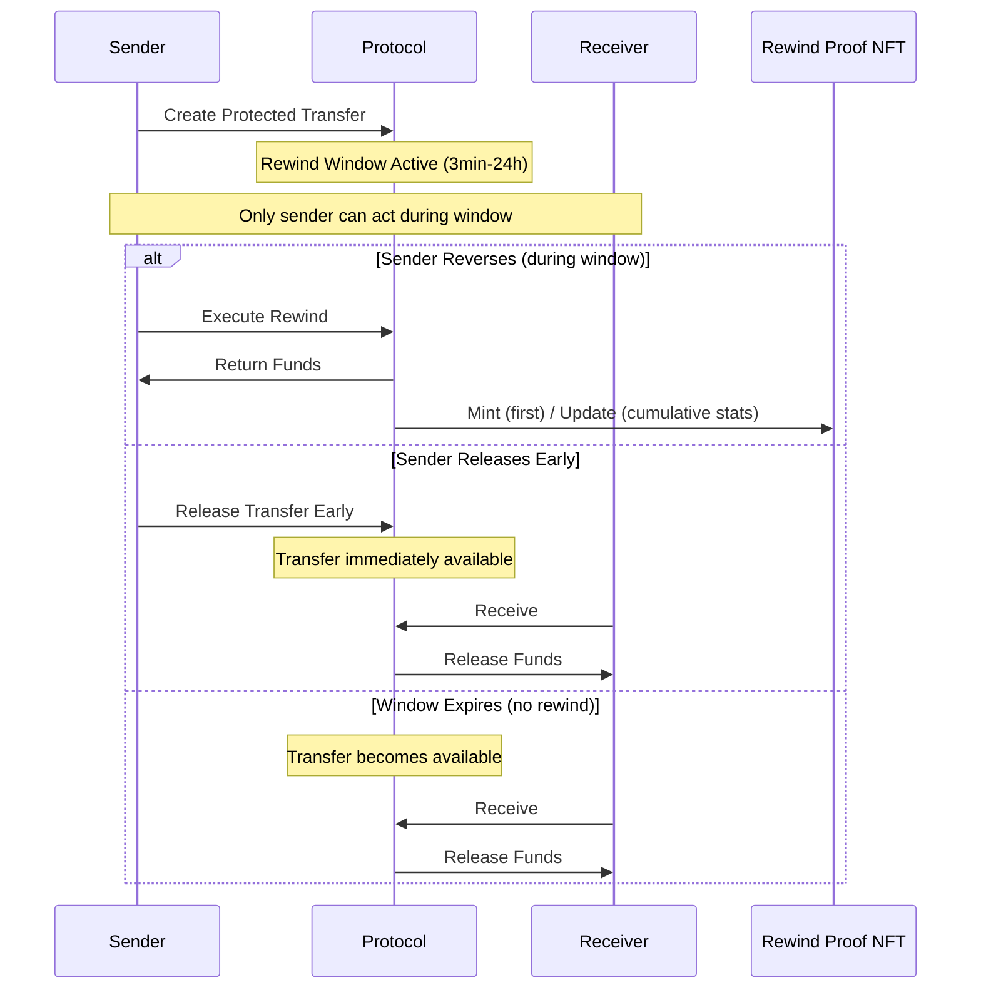

# Rewind X Lightpaper

**Protected ERC-20 Transfers with Time-Bounded Reversibility**

> This describes the V1 Origin Edition. Some features described are planned for future versions.

Version 1.4.2 | Classification: PUBLIC | March 2026

---

## Table of Contents

1. [Problem: Finality Without Safety](#1-problem-finality-without-safety)
2. [Core Principles](#2-core-principles)
3. [System Overview](#3-system-overview)
4. [Lifecycle of a Protected Transfer](#4-lifecycle-of-a-protected-transfer)
5. [Security Model](#5-security-model)
6. [Fee Model](#6-fee-model)
7. [Rewind Proof NFT: The Proof Layer](#7-rewind-proof-nft-the-proof-layer)
8. [Use Cases](#8-use-cases)
9. [Limitations](#9-limitations)
10. [Vision](#10-vision)
11. [Prior Art & Differentiation](#11-prior-art-differentiation)
12. [Appendix: Definitions](#12-appendix-definitions)

---

## Abstract

Rewind X introduces time-bounded reversibility for on-chain token transfers, a capability missing from blockchain infrastructure since inception.

Billions of dollars in cryptocurrency have been lost permanently due to human error, phishing attacks, and address manipulation. Unlike traditional finance, blockchain offers no recourse. Once a transaction confirms, funds are gone forever.

Rewind X solves this through Protected Transfers: a non-custodial, deterministic mechanism that gives senders a configurable window to reverse transactions before final settlement. Windows range from 3 minutes to 24 hours. Protected transfers settle as net amounts: the Protected Transfer Fee is deducted at creation; the recipient receives the net held amount if no rewind occurs. The protocol requires no manual intervention, holds no private keys, and emits tamper-evident on-chain proof signals for reversals, indexed via the Rewind Proof NFT system.

Rewind X is infrastructure: a protocol-level safety layer that can be used directly by individuals and scaled through integrations with wallets, treasuries, and DeFi applications. As wallets integrate systems like Rewind X, users may experience protected transfers as a simple optional safety layer — without custodial intermediaries.

---

## 1. Problem: Finality Without Safety

Blockchain's core strength, irreversible finality, is also a key barrier to mainstream adoption.

### The Cost of Irreversibility

The causes are predictable and recurring: typographical errors in wallet addresses, copy-paste mistakes, decimal point errors, address poisoning attacks where malicious actors create lookalike addresses, and phishing schemes that redirect funds to attacker-controlled wallets.

Traditional financial systems have evolved comprehensive safeguards: chargebacks, fraud protection, dispute resolution, and regulatory oversight. When a bank customer sends money to the wrong account, there are established processes for recovery. When a credit card is compromised, transactions can be reversed.

Cryptocurrency offers none of these protections. The very properties that make blockchain valuable, decentralization, censorship resistance, trustless operation, also mean there is no central authority to appeal to, no customer service to call, no way to undo a mistake.

### The Adoption Barrier

This creates a fundamental problem for cryptocurrency adoption. Sophisticated users implement elaborate verification procedures before every transaction. Enterprise treasury managers require multiple approval layers. Yet mistakes still happen: a single misplaced character in an address can result in total loss.

For mainstream users, this level of risk is unacceptable. The mental overhead of knowing that any transaction could be an irreversible catastrophe prevents the casual usage that characterizes successful financial technologies.

The market needs a solution that adds a safety layer without compromising decentralization or custody.

---

## 2. Core Principles

Rewind X is built on five core principles that distinguish it from centralized alternatives:

### Non-Custodial Architecture

Funds are held in smart contracts under deterministic rules; no party controls them via private keys. During a Protected Transfer, tokens remain in a time-bounded state controlled entirely by smart contract logic. No entity, not the protocol team, not validators, not any third party, can access, redirect, or freeze these funds outside the deterministic rules encoded on-chain.

### Deterministic Execution

Every protocol operation follows predetermined logic with no manual intervention. Whether a transfer finalizes or reverses depends solely on on-chain conditions: time elapsed, sender action, receiver action. There are no human reviewers, no fraud assessment teams, no subjective decisions. Settlement outcomes are deterministic; emergency pause is only for protocol safety and cannot redirect funds.

### Time-Bounded Windows

Reversibility is strictly limited. Windows are configurable from 3 minutes to 24 hours.

The sender's selected window defines the guaranteed period during which a rewind can be executed. For safety, settlement may finalize shortly after the selected window due to deterministic hold and finality buffers that prevent race conditions and flash-style abuse. Once this deterministic boundary is reached, the transfer becomes available for the recipient to receive. After expiry, the transfer is irreversible. This bounded approach preserves blockchain's finality guarantee while providing a safety buffer.

### Trust-Minimized Controls

Administrative controls are strictly bounded and cannot move user funds, redirect balances, or override individual transfer outcomes. Emergency controls exist only for protocol-wide pause functionality to halt new operations during incidents; they preserve all balances in place and do not enable selective intervention on specific users or transfers.

### Transparent Proofs

Every reversal emits a tamper-evident on-chain proof trail, indexed by the Rewind Proof NFT system. This creates a verifiable audit trail suitable for compliance requirements, dispute documentation, and forensic analysis.

---

## 3. System Overview

Rewind X operates as a protocol-level safety layer that wraps standard token transfers before final settlement, adding deterministic reversibility without changing L1 consensus or chain rules.

### Protected Transfers

When a user initiates a Protected Transfer, tokens enter a time-bounded state. The transfer is recorded on-chain with a unique identifier, the sender's address, the recipient's address, the token and amount, and the window duration.

During the rewind window, only the sender can act. Three outcomes are possible: the sender reverses the transfer, the sender releases early, or the window expires and either party can complete settlement.

### Multi-Token Support

The protocol operates with supported ERC-20 tokens with reliable price feeds. V1 supports 38 tokens on BNB Chain, including major stablecoins and popular DeFi assets.

### Integrity Protections

The protocol includes multiple layers of protection against manipulation and abuse. These systems operate transparently and deterministically, ensuring fair access while preventing exploitation patterns that could harm legitimate users or protocol stability.

---

## 4. Lifecycle of a Protected Transfer

Every Protected Transfer follows a four-stage lifecycle with deterministic transitions.

### Stage 1: Transfer Creation

The sender initiates a Protected Transfer by specifying the recipient, token, amount, and desired window duration (hours or minutes). The protocol validates inputs, calculates applicable fees based on the sender's NFT tier, and records the transfer in a non-upgradeable on-chain registry.

At creation, the protocol deducts the Protected Transfer Fee from the transfer amount. The net amount is held under deterministic contract rules until received or rewound.

### Stage 2: Rewind Window

The rewind window begins immediately upon transfer creation. During this period, the sender retains exclusive reversal rights. No other party (not the receiver, not the protocol, not any external entity) can act. The receiver cannot receive the transfer until the window expires.

Critically, no party can extend or shorten the window after creation. The duration (hours or minutes) is fixed at initiation and enforced deterministically by on-chain logic.

### Stage 3: Resolution

Resolution occurs through one of three paths:

**Sender Reversal:** The sender initiates a rewind through a two-step process:

1. **Request:** Call `requestRewind()` to register intent
2. **Execute:** After a short security delay, call `executeRewind()` to complete

This design provides a final confirmation moment and reduces front-running risk. The protocol validates the request (window still open, sender is original initiator, limits not exceeded). On success, funds return to the sender's wallet.

**Early Release:** The sender can release the transfer at any time during the active window by calling `releaseTransferEarly()`. This immediately allows the recipient to receive the transfer, eliminating the remaining wait time. Useful when both parties want faster settlement. The sender retains no reversal rights after early release.

**Window Expiry:** If the rewind window reaches its deterministic settlement boundary without sender action, the transfer moves to settlement. Either the sender or recipient can complete settlement (technically: `claim()`). No additional fee is charged at this step. Settlement is irreversible once completed. After expiry, funds remain available until either party acts.

### Stage 4: Rewind Proof NFT

On a sender's first successful rewind, the protocol mints a Rewind Proof NFT to the sender. Subsequent rewinds by that sender update the same token's cumulative stats and refresh the latest rewind record (overwritten on each update); the token does not store a full rewind history. Rewind Proof NFTs are transferable and function as transferable proof objects (not identity badges). If a Rewind Proof is transferred, the sender's primary mapping is cleared. Subsequent rewinds by that sender will mint a new Rewind Proof instead of updating the transferred token.

---

## 5. Security Model

Rewind X uses multiple independent protection layers.

### Immutable Core

Core transfer records are non-upgradeable once deployed. Upgradeability, where present, is limited to safety and supporting modules and cannot override individual transfer outcomes.

### No Privileged Functions

The protocol contains no privileged/admin functions capable of moving user funds, redirecting balances, or overriding individual transfer outcomes. Emergency controls are limited to pausing operations; balances remain in place.

### Signature-Based Authorization

Certain safety-critical actions in Rewind X require explicit user consent, such as reversing a transfer.

This consent is expressed through a digital signature. A signature is a one-time, explicit confirmation that a user agrees to a specific action under clearly defined conditions. It does not grant ongoing access, custody, or control over funds.

Each signature is bound to a single action, includes a strict expiration time, and cannot be reused. Once the signature expires or is consumed, it becomes invalid.

Rewind X uses typed structured data signing (EIP-712) to ensure that users can clearly see and approve exactly what they are authorizing. This mechanism prevents silent actions, replay across contexts, and unintended permission escalation, while remaining compatible with both externally owned accounts and contract wallets via standard signature verification.

### Checks-Effects-Interactions Pattern

All state-changing operations follow the CEI pattern, preventing reentrancy attacks. External calls occur only after all internal state updates complete, eliminating a common class of smart contract vulnerabilities.

### Rate Limiting and Abuse Detection

The protocol implements multi-layer protections against systematic abuse. These operate deterministically based on on-chain behavior patterns.

### Predefined Safety Mechanisms

Automated safeguards can pause specific protocol functions if anomalous conditions are detected. These operate transparently according to predefined parameters, not manual intervention.

### External Review

V1 has undergone 12 months of continuous internal security review combining automated analysis, manual testing, and fork-based mainnet simulation.

An independent external audit is planned once real-world usage and funding support a full engagement.

For details, see the [Security Overview](/security).

---

## 6. Fee Model

The protocol employs a two-component fee structure designed to align incentives and protect against systematic abuse.

### Fee Components

**Protected Transfer Fee (1–3%):** Charged when creating a Protected Transfer and deducted from the transfer amount. 1% for preferred supported tokens, up to 3% for extended / non-preferred supported tokens. NFT tiers provide discounts on this fee.

**Rewind Execution Fee (1.5%):** Charged only if a rewind is actually executed. This is a flat fee that applies equally to all users. It is separate from the transfer fee and is not discounted by NFT tiers. Calculated on-chain with fixed rules, no exceptions.

### NFT Tier Fee Benefits

NFT tiers affect the Protected Transfer Fee only:

- Rewind Proof: 0% discount (auto-mint after first rewind)
- Genesis: 10% discount (auto-mint after 3 rewinds of $10+)
- Gatekeeper: 20% discount (auto-mint after 10 rewinds of $10+ each)

The Rewind Execution Fee (1.5%) is separate and not discounted.

Advanced fee models may be introduced in future versions.

---

## 7. Rewind Proof NFT: The Proof Layer

Rewind Proof NFTs serve as the protocol's tamper-evident proof index system.

### Purpose

Rewind Proof NFTs provide a cumulative, tamper-evident proof index for rewind activity. Because they are transferable, the NFT represents a verifiable proof object rather than an identity credential of the current holder. For technical details on minting, updates, and transfer behavior, see Stage 4: Rewind Proof NFT.

### Why NFT Format

The NFT standard provides several advantages for proof-of-action records: standard tooling enables verification through any NFT-compatible interface, on-chain storage ensures availability independent of any centralized service, and the transferable design enables consolidation into dedicated audit or compliance wallets while remaining verifiable by any third party directly on-chain.

### Data Contained

Each Rewind Proof NFT stores the latest rewind metadata (e.g., transfer ID, timestamp, amount) and cumulative statistics. The latest rewind fields are overwritten on each update, while cumulative stats continue to accumulate. Full verification remains possible on-chain via the underlying protected transfer records and emitted events.

### Use Cases

Rewind Proof NFTs enable multiple use cases: corporate audit trails for treasury operations, compliance documentation for regulated entities, dispute evidence for counterparty disagreements, and historical records for tax or legal purposes.

Rewind Proof NFTs are publicly verifiable on-chain. Organizations can consolidate proof NFTs by transferring them to dedicated compliance or audit wallets, while verification remains possible for any third party directly on-chain.

---

## 8. Use Cases

### Retail Error Recovery

Individual users can protect routine transfers against common mistakes. Sending to a wrong address, fat-finger errors, or falling for phishing attempts can be reversed within the window period.

### Treasury Protection

Corporate treasuries and DAO multi-sigs can add a safety layer to outgoing payments. Finance teams gain a buffer to catch errors before funds leave organizational control permanently.

### Wallet Integration

Wallet providers can integrate Protected Transfers as a safety feature, differentiating their product through user protection capabilities. Users can opt into reversibility for transfers where the additional security outweighs the settlement delay.

### AI Agent Safety (Planned)

Future versions may explore additional execution safety modes for automated workflows.

V1 operates in Manual Mode only: users create protected transfers and request rewinds manually with full control.

### Compliance-Friendly Layer

Regulated entities can document reversal history through Rewind Proof NFTs, providing audit trails for compliance reporting and regulatory examination.

### Enterprise Payouts

Organizations processing high-volume payments (payroll, vendor payments, dividend distributions) can protect against systematic errors or compromised processes.

---

## 9. Limitations

Rewind X is not a universal solution. Understanding its boundaries is essential for appropriate use.

### Native Tokens Not Supported

The protocol operates with supported ERC-20 tokens only. Native blockchain tokens (BNB) require wrapped versions (WBNB).

### Sender-Only Reversal

Only the original sender can initiate a rewind. If a sender is compromised or unavailable, the receiver cannot reverse on their behalf. This is a deliberate design choice. Allowing receiver reversals would create significant abuse vectors.

### Time-Bounded, Not Indefinite

Windows have maximum durations. Once expired, finality is absolute. The protocol does not offer indefinite reversibility, which would fundamentally undermine blockchain utility.

### Minimum Window Granularity

Protected Transfers have a minimum rewind window of 3 minutes and a maximum of 24 hours. This prevents "instant reversibility" patterns that could enable abuse while still supporting faster workflows.

### No Fraud Adjudication

The protocol makes no judgments about transaction legitimacy. It cannot determine if a transfer was fraudulent, mistaken, or intentional. It simply provides a time window for sender action.

### Requires Sender Action (Manual Mode)

Reversals require active sender intervention within the window. Users must monitor their transfers and act within the available window.

### Net Settlement Amounts

If a rewind is executed, the sender recovers the net held amount (held under deterministic contract rules) minus protocol fees. If no rewind occurs, the recipient receives the net held amount (after the protection fee is deducted at creation).

### Receive Liveness

If neither party acts after window expiry, funds remain held under deterministic contract rules until settlement is completed. The protocol does not auto-release or return funds.

---

## 10. Vision

Rewind X introduces non-custodial, protocol-level reversibility for ERC-20 transfers on public blockchains.

The goal is not to replace blockchain finality. It is to make finality safer. By providing a bounded window for human review and error correction, the protocol removes a critical barrier to mainstream cryptocurrency adoption.

We envision Rewind X as infrastructure: a foundational layer that wallets, protocols, and applications build upon to offer users protection they currently lack. Just as SSL became an invisible security layer for the web, reversibility can become a standard option for blockchain transfers.

The technical capability exists. The demand is clear. What remains is execution: secure deployment and ecosystem integration.

---

## 11. Prior Art & Differentiation

Rewind X builds on the idea of reversible transfers with an implementation designed for real decentralized infrastructure. Earlier approaches, such as custodial recovery services, backend-driven approval flows, or token-specific custody contracts, either required trust in intermediaries or broke core decentralization guarantees.

Rewind X differs in several essential ways:

- **Fully non-custodial and non-upgradeable at the core:** No trusted intermediaries, no manual intervention, unlike custodial recovery services. No privileged keys to move funds; emergency controls can only pause the protocol, not override individual transfers.
- **Protocol-native, not application-layer:** Works at the transfer level, not as a wrapper or separate custody contract.
- **Integration-ready:** Usable directly by individuals, and designed to scale through wallet, treasury, and DeFi integrations.

Rewind X does not remove finality. It makes finality safer.

---

## 12. Appendix: Definitions

**Protected Transfer:** A token transfer initiated through Rewind X that includes a time-bounded reversal window before final settlement.

**Rewind Window:** The configurable period (3 minutes to 24 hours) during which the sender can rewind a Protected Transfer.

**Rewind:** The action of reversing a Protected Transfer, returning funds to the original sender.

**Rewind Proof NFT:** A transferable on-chain proof object minted to a sender on their first successful rewind and updated on subsequent rewinds. It stores cumulative stats plus the latest rewind record; underlying transfer records and events remain the source of truth. Transferability allows consolidation in audit/compliance wallets and does not imply identity or reputation of the current holder.

**Deterministic Settlement:** The protocol's guarantee that transfer outcomes depend solely on on-chain conditions with no manual intervention or subjective judgment.

**Non-Custodial:** The protocol architecture where user funds are never held by or accessible to the protocol team or any third party outside deterministic smart contract logic.

**Settlement:** The irreversible completion of a Protected Transfer, triggered when either the sender or recipient calls receive (technically: `claim()`) after window expiry or early release.

**Early Release:** The sender's option to release the transfer at any time during the active window via `releaseTransferEarly()`. Makes the transfer immediately available for the recipient without waiting for window expiry.

**Protected Transfer Fee (1–3%):** The fee charged when creating a Protected Transfer. 1% for preferred tokens, up to 3% for extended tokens. NFT tiers provide discounts on this fee.

**Rewind Execution Fee (1.5%):** A flat fee charged when executing a rewind. This fee is not discounted by NFT tiers.

---

## Legal Disclaimer

This document is informational and does not constitute financial, legal, or investment advice. Timelines and features may adjust based on audits, security reviews, and partner integrations.

Rewind functionality is limited to defined protocol conditions and time windows and does not guarantee recovery in all cases.

Cryptocurrency involves significant risk including potential loss of principal. Conduct independent research and consult qualified advisors before participating in any blockchain protocol.

---

**Rewind X — Making Finality Safer**

